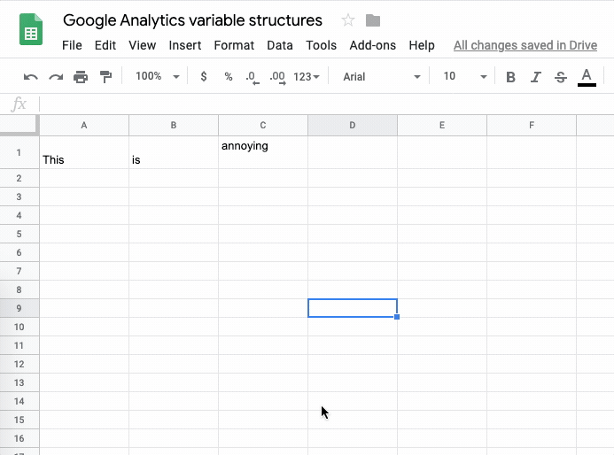

# Trim Annoying Whitespace from Google Sheets

As referenced in [this amusing thread](https://support.google.com/docs/thread/18235069?hl=en), Google Sheets has a bad habit of adding random trailing whitespace to cells when you hit `Tab` or `Enter`. (Especially if you use Firefox, and this quirk is [potentially on purpose!](https://bugzilla.mozilla.org/show_bug.cgi?id=1609918))

When this happens, the text in those cells appears to be stuck to the top of the cell, or top aligned, but changing the vertical alignment doesn't fix it.

There is a built-in function in Google Sheets you can use: `Data` → `Trim Whitespace`. This fixes the problem reliably, but you have to manually select the cells you want to fix each time, and this menu function doesn't include a keyboard shortcut.

This repository contains a simple [Macro](https://developers.google.com/apps-script/guides/sheets/macros) that does the following:

* Selects the entire sheet
* Runs `Data` → `Trim Whitespace`
* Returns you to the cell, range, or ranges you had selected before you ran the macro

## Installation

Google makes it pretty much impossible to import a macro from anywhere outside your account (which is annoying, but probably good security policy).

So in order to get this going, you have to pretend to record a macro for yourself, edit that macro, and replace it with the code you'll find in [trim-whitespace.gs](trim-whitespace.gs).

Here are the steps. It's pretty painless.

1. In a Google Sheet document, go to `Tools` → `Macros` → `Record Macro`.
1. Click `Save` in the Macro recording card that pops up at the bottom of the screen.
1. Go to `Tools` → `Macros` → `Manage Macros`.
1. Click the three-dot menu icon to the right of the macro you just recorded, and select `Edit script`.
1. Select all in the script editor that comes up, and copy & paste the contents of [trim-whitespace.gs](trim-whitespace.gs).
1. Click the disk icon in the menu bar, go to `File` → `Save`, or hit `cmd`/`ctrl` + `S`.
1. Close the script editor browser tab.
1. Back in your Google Sheets document tab, go ahead and give your macro a resonable name like "Trim Whitespace" and a useful keyboard shortcut. I chose `cmd`+`option`+`shift`+`7` and it's been pretty easy to get used to hitting that occasionally to clean up the sheet.

## Contributing

If you have ways to make this macro even better, do let me know, and/or submit a pull request.

I'm at [@donnieclapp](https://twitter.com/donnieclapp) on Twitter.